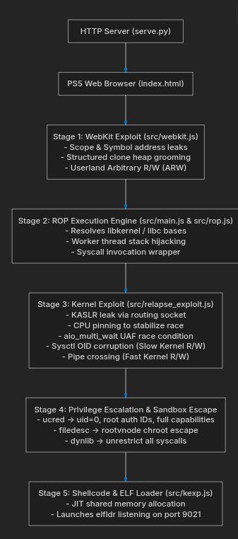
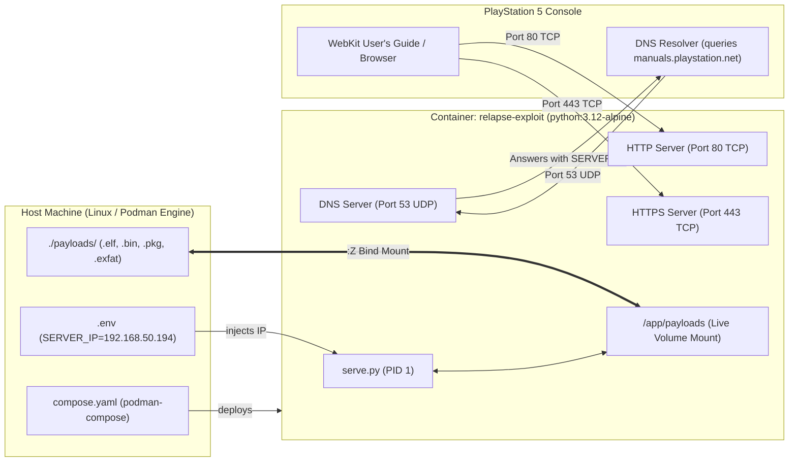

```mermaid
flowchart TD
    subgraph S1["1. Delivery & Environment Setup"]
        A["serve.py (HTTP 80, HTTPS 443, DNS 53)"] --> B["index.html"]
        B --> C["src/firmware.js<br/>Match User-Agent"]
        C --> D["Load offsets/<fw>.js"]
    end

    subgraph S2["2. WebKit Userland Exploit"]
        D --> E["src/webkit.js<br/>prepareExploitObjects()"]
        E --> F["JSC Prototype Getter Bug<br/>leakScopeObject()"]
        F --> G["Oversized Symbol.toString()<br/>Leak fakeHost & targetHolder"]
        G --> H["MessageChannel Heap Grooming<br/>history.replaceState Deserialization"]
        H --> I["Corrupted Uint8Array Vector<br/>src/utils/mem.js (ARW Window)"]
        I --> J["Resolve libSceNKWebKit Base<br/>via __ps5NativeCtor"]
    end

    subgraph S3["3. Worker-Based ROP Engine"]
        J --> K["src/main.js & src/rop.js<br/>Resolve libkernel & libc"]
        K --> L["Spawn Web Worker<br/>src/utils/rop_slave.js"]
        L --> M["Traverse _thread_list<br/>Locate Worker Stack Return Slot"]
        M --> N["Hijack Return Slot via setjmp/longjmp<br/>Execute Syscalls via System V ABI"]
        N --> O["Verify Execution with SYS_GETPID"]
    end

    subgraph S4["4. Kernel Exploitation"]
        O --> P["src/relapse_exploit.js<br/>leakKernelBase() via AF_ROUTE"]
        P --> Q["pinToSingleCore()<br/>cpuset & rtprio_thread (PRI_REALTIME)"]
        Q --> R["parkAioWorkers()<br/>Park 24 Background Workers"]
        R --> S["Trigger aio_multi_wait UAF Race<br/>via ioctl churn & Sprayed Waiters"]
        S --> T["armKernelReadWrite()<br/>Corrupt kern.smp.cpus & kern.smp.maxcpus OIDs"]
        T --> U["Slow Kernel R/W Active"]
    end

    subgraph S5["5. Fast R/W, Cleanup & Escalation"]
        U --> V["locatePipes() & crossPipes()<br/>Master Pipe redirects Victim Buffer"]
        V --> W["Fast Kernel R/W Active"]
        W --> X["defuseAioGroups()<br/>Zero Armed Group Waiters"]
        X --> Y["escalate()<br/>ucred (root), rootvnode (chroot escape), dynlib (syscall unmask)"]
    end

    subgraph S6["6. Payload Staging & Daemon"]
        Y --> Z["src/kexp.js<br/>Patch payloads/kexp_2026_05_25.bin"]
        Z --> AA["Allocate RWX via SYS_JITSHM_CREATE"]
        AA --> AB["Map payloads/elfldr-ps5-1360.elf"]
        AB --> AC["Spawn Thread via pthread_create"]
        AC --> AD["ELF Loader Daemon Listening on Port 9021"]
    end
```

# PS5 Relapse Exploit

> **Supported Firmware Scope:** PlayStation 5 System Software `7.00` through `13.60` (33 supported firmware profiles)  
> **Target Output:** Arbitrary Kernel R/W, Root Privileges (`uid = 0`), Full Sandbox Escape, and ELF Loader Daemon listening on port `9021`.  
> **Containerization Runtime:** Rootless & Rootful Podman, Podman Compose, Multi-Distro Linux (`Fedora`, `Debian`, `Ubuntu`, `Arch`, `openSUSE`).



## Stability & Operating Notes
- **WebKit Userland Stage:** JavaScriptCore heap grooming and structured clone deserialization may require a few attempts depending on initial memory layout. If the browser tab stalls or shows an "Out of Memory" alert, reload the page.
- **Kernel UAF Stage:** The asynchronous I/O (`aio_multi_wait`) race condition timing window is tuned for stability. In the rare event of a kernel panic, the console will safely reboot to the main dashboard.

---

## 1. Supported Firmware Matrix

The exploit engine dynamically parses the browser `User-Agent` string to detect the exact PlayStation 5 system software version and automatically loads the matching gadget, syscall, and symbol offset profile from [`offsets/<firmware>.js`](offsets/):

| Firmware | WebKit Exploitation | Kernel UAF Exploit | Offset Profile | Status |
| :---: | :---: | :---: | :---: | :---: |
| **7.00** | JSC Prototype Getter | `aio_multi_wait` UAF | [`offsets/7.00.js`](offsets/7.00.js) | Supported |
| **7.01** | JSC Prototype Getter | `aio_multi_wait` UAF | [`offsets/7.01.js`](offsets/7.01.js) | Supported |
| **7.20** | JSC Prototype Getter | `aio_multi_wait` UAF | [`offsets/7.20.js`](offsets/7.20.js) | Supported |
| **7.40** | JSC Prototype Getter | `aio_multi_wait` UAF | [`offsets/7.40.js`](offsets/7.40.js) | Supported |
| **7.60** | JSC Prototype Getter | `aio_multi_wait` UAF | [`offsets/7.60.js`](offsets/7.60.js) | Supported |
| **7.61** | JSC Prototype Getter | `aio_multi_wait` UAF | [`offsets/7.61.js`](offsets/7.61.js) | Supported |
| **8.00** | JSC Prototype Getter | `aio_multi_wait` UAF | [`offsets/8.00.js`](offsets/8.00.js) | Supported |
| **8.20** | JSC Prototype Getter | `aio_multi_wait` UAF | [`offsets/8.20.js`](offsets/8.20.js) | Supported |
| **8.40** | JSC Prototype Getter | `aio_multi_wait` UAF | [`offsets/8.40.js`](offsets/8.40.js) | Supported |
| **8.60** | JSC Prototype Getter | `aio_multi_wait` UAF | [`offsets/8.60.js`](offsets/8.60.js) | Supported |
| **9.00** | JSC Prototype Getter | `aio_multi_wait` UAF | [`offsets/9.00.js`](offsets/9.00.js) | Supported |
| **9.20** | JSC Prototype Getter | `aio_multi_wait` UAF | [`offsets/9.20.js`](offsets/9.20.js) | Supported |
| **9.40** | JSC Prototype Getter | `aio_multi_wait` UAF | [`offsets/9.40.js`](offsets/9.40.js) | Supported |
| **9.60** | JSC Prototype Getter | `aio_multi_wait` UAF | [`offsets/9.60.js`](offsets/9.60.js) | Supported |
| **10.00** | JSC Prototype Getter | `aio_multi_wait` UAF | [`offsets/10.00.js`](offsets/10.00.js) | Supported |
| **10.01** | JSC Prototype Getter | `aio_multi_wait` UAF | [`offsets/10.01.js`](offsets/10.01.js) | Supported |
| **10.20** | JSC Prototype Getter | `aio_multi_wait` UAF | [`offsets/10.20.js`](offsets/10.20.js) | Supported |
| **10.40** | JSC Prototype Getter | `aio_multi_wait` UAF | [`offsets/10.40.js`](offsets/10.40.js) | Supported |
| **10.60** | JSC Prototype Getter | `aio_multi_wait` UAF | [`offsets/10.60.js`](offsets/10.60.js) | Supported |
| **11.00** | JSC Prototype Getter | `aio_multi_wait` UAF | [`offsets/11.00.js`](offsets/11.00.js) | Supported |
| **11.20** | JSC Prototype Getter | `aio_multi_wait` UAF | [`offsets/11.20.js`](offsets/11.20.js) | Supported |
| **11.60** | JSC Prototype Getter | `aio_multi_wait` UAF | [`offsets/11.60.js`](offsets/11.60.js) | Supported |
| **12.00** | JSC Prototype Getter | `aio_multi_wait` UAF | [`offsets/12.00.js`](offsets/12.00.js) | Supported |
| **12.02** | JSC Prototype Getter | `aio_multi_wait` UAF | [`offsets/12.02.js`](offsets/12.02.js) | Supported |
| **12.20** | JSC Prototype Getter | `aio_multi_wait` UAF | [`offsets/12.20.js`](offsets/12.20.js) | Supported |
| **12.40** | JSC Prototype Getter | `aio_multi_wait` UAF | [`offsets/12.40.js`](offsets/12.40.js) | Supported |
| **12.60** | JSC Prototype Getter | `aio_multi_wait` UAF | [`offsets/12.60.js`](offsets/12.60.js) | Supported |
| **12.70** | JSC Prototype Getter | `aio_multi_wait` UAF | [`offsets/12.70.js`](offsets/12.70.js) | Supported |
| **13.00** | JSC Prototype Getter | `aio_multi_wait` UAF | [`offsets/13.00.js`](offsets/13.00.js) | Supported |
| **13.20** | JSC Prototype Getter | `aio_multi_wait` UAF | [`offsets/13.20.js`](offsets/13.20.js) | Supported |
| **13.40** | JSC Prototype Getter | `aio_multi_wait` UAF | [`offsets/13.40.js`](offsets/13.40.js) | Supported |
| **13.42** | JSC Prototype Getter | `aio_multi_wait` UAF | [`offsets/13.42.js`](offsets/13.42.js) | Supported |
| **13.60** | JSC Prototype Getter | `aio_multi_wait` UAF | [`offsets/13.60.js`](offsets/13.60.js) | Supported |

---

## 2. Executive Architecture Overview

The **Relapse Exploit** (`Relapse-Exploit`) is an advanced, multi-stage jailbreak toolchain for the PlayStation 5. The exploit chains together:
1. **Userland WebKit Exploit:** Exploits JavaScriptCore (JSC) prototype getter reflection and structured clone deserialization to gain Userland Arbitrary Read/Write (ARW).
2. **Worker-Based ROP Engine:** Hijacks a Web Worker's execution stack via `libkernel` thread list traversal to execute arbitrary FreeBSD/Sony kernel system calls using `setjmp`/`longjmp` context switching.
3. **Kernel Use-After-Free (UAF) Exploit:** Exploits an asynchronous I/O race condition in `aio_multi_wait` combined with an `AF_ROUTE` KASLR bypass to achieve Slow Kernel R/W via sysctl OID corruption.
4. **Fast Kernel R/W Upgrade:** Crosses POSIX pipe buffers to provide high-speed arbitrary kernel memory read and write.
5. **Privilege Escalation & Jailbreak:** Overwrites process credentials (`ucred`), breaks out of chroot jail (`filedesc` / `rootvnode`), and unmasks restricted system calls (`dynlib`).
6. **Payload Stager & ELF Loader:** Allocates executable memory via `jitshm_create`, dynamically patches and maps shellcode (`kexp`), and launches the background ELF loader daemon on port `9021`.

---

## 3. End-to-End Execution Flowchart



---

## 4. Technical Phase-by-Phase Deep Dive

### Phase 1: Delivery & Multi-Protocol Server Architecture ([serve.py](file:///home/wolfgangsan/Repositories/PS5%20Hack/Relapse-Exploit/serve.py))

1. **Integrated Multi-Protocol Dispatcher:**
   - **HTTP Server (`80/tcp`):** Delivers the web application frontend, HTML layout, exploit modules, and payload binary streams. Serves the REST API (`/api/info`, `/api/payloads`, `/api/send-payload`).
   - **HTTPS Server (`443/tcp`):** Wraps HTTP delivery over TLS using an auto-generated self-signed certificate for `CN=manuals.playstation.net`. When the PS5 opens Settings -> User's Guide, the internal browser requests `https://manuals.playstation.net/document/en/ps5/index.html`.
   - **DNS Responder (`53/udp`):** Listens for DNS lookups originating from the PS5. Any DNS query (`manuals.playstation.net` or fallback hostnames) is intercepted and answered with the server's LAN IP (`SERVER_IP`).
   - **HTTP Cache Suppression:** Attaches `Cache-Control: no-store, no-cache, must-revalidate` headers to all assets to ensure fresh execution every run.
2. **Firmware Matching ([src/firmware.js](file:///home/wolfgangsan/Repositories/PS5%20Hack/Relapse-Exploit/src/firmware.js)):**
   - Matches the PS5 browser user agent string against `/PlayStation 5\/(\d+\.\d+)/`.
   - Verifies supported firmware index and loads `offsets/<fw>.js`.

---

### Phase 2: WebKit Arbitrary Read/Write Primitive ([src/webkit.js](file:///home/wolfgangsan/Repositories/PS5%20Hack/Relapse-Exploit/src/webkit.js), [src/utils/mem.js](file:///home/wolfgangsan/Repositories/PS5%20Hack/Relapse-Exploit/src/utils/mem.js))

1. **JSC Prototype Getter Bug (`leakScopeObject`):**
   - Leverages prototype reflection (`Leaker.prototype.__proto__ = new Proxy({}, { get: (t, p, r) => r })`) to access the internal lexical scope object.
   - Binds getter properties referencing `fakeHost` and `targetHolder`.
   - Calling `Symbol.prototype.toString` leaks the 64-bit memory addresses of `fakeHost` and `targetHolder`.
2. **Heap Grooming & Structured Clone Deserialization:**
   - Pre-allocates 512 heap chunks of `0x10000` bytes into a `keepAlive` array to stabilize the allocator.
   - Releases a `0x400000` memory slab using `MessageChannel.port1.postMessage` transfer lists and sprays with 64-bit pointers pointing to `fakeAddress`.
   - Deserializes `history.state`. Index 2 of the cloned array overlaps the sprayed structure, corrupting a `Uint8Array`'s backing buffer pointer.
3. **Memory Window Installation ([src/utils/mem.js](file:///home/wolfgangsan/Repositories/PS5%20Hack/Relapse-Exploit/src/utils/mem.js)):**
   - Binds `read1`, `read2`, `read4`, `read8`, `write1`, `write2`, `write4`, `write8`, and `leakval`, providing stable Arbitrary Read/Write across userland memory.

---

### Phase 3: Worker-Based Userland ROP Engine ([src/main.js](file:///home/wolfgangsan/Repositories/PS5%20Hack/Relapse-Exploit/src/main.js), [src/rop.js](file:///home/wolfgangsan/Repositories/PS5%20Hack/Relapse-Exploit/src/rop.js))

1. **Module Base Resolution:**
   - Traverses import tables to locate:
     - `libSceNKWebKitBase`
     - `libSceLibcInternalBase`
     - `libKernelBase`
2. **Web Worker Stack Discovery ([src/utils/rop_slave.js](file:///home/wolfgangsan/Repositories/PS5%20Hack/Relapse-Exploit/src/utils/rop_slave.js)):**
   - Spawns a dedicated Web Worker that halts in a waiting loop (`self.onmessage`).
   - Traverses the `libKernel` thread linked list (`OFFSET_lk__thread_list`) looking for a thread with a `0x80000` (512 KB) stack.
   - Locates the return address slot matching `libKernelBase + OFFSET_lk_worker_wait_return`.
3. **Execution via `setjmp` / `longjmp`:**
   - Allocates a `0x40` byte CPU context structure.
   - Pushes arguments following the System V AMD64 ABI: `rdi`, `rsi`, `rdx`, `rcx`, `r8`, `r9`.
   - Overwrites the worker return slot with a `pop rsp` gadget pointing to the synthesized ROP chain.
   - Triggers execution with `worker.postMessage(0)`.
   - Validates ROP execution by calling `SYS_GETPID` (`0x014`).

---

### Phase 4: Kernel Exploitation ([src/relapse_exploit.js](file:///home/wolfgangsan/Repositories/PS5%20Hack/Relapse-Exploit/src/relapse_exploit.js))

1. **KASLR Defeat (`leakKernelBase`):**
   - Queries `SYS_NETGETIFLIST` and issues `SYS_SOCKET(AF_ROUTE, SOCK_RAW, 0)`.
   - Dispatches an `RTM_GET` query requesting `RTA_DST | RTA_AUTHOR`.
   - Inspects the uninitialized kernel stack slot at `author + 184` to retrieve a kernel `.text` pointer.
   - Subtracts static offset `kaslr.retStatic` to calculate the kernel base address `kbase`.
2. **Thread Pinning & Worker Parking:**
   - Binds the execution thread to a single CPU core via `SYS_CPUSET_SETAFFINITY`.
   - Elevates scheduling priority to realtime via `SYS_RTPRIO_THREAD` (`PRI_REALTIME`).
   - Opens an empty UNIX socketpair and queues 24 asynchronous read requests (`SYS_AIO_SUBMIT_CMD`, `AIO_CMD_READ`).
   - Polls until all 24 worker threads transition to state 2, parking background kernel threads.
3. **The Race Condition (`aio_multi_wait` UAF):**
   - Executes an atomic ROP batch:
     - 32 `SYS_IOCTL` churn requests.
     - `SYS_AIO_MULTI_WAIT` with a `10,000 µs` timeout.
     - 256 trailing `SYS_IOCTL` churn requests.
     - 64 `SYS_AIO_SUBMIT_CMD` requests using forged waiter nodes.
4. **Slow Kernel Read/Write via Corrupted Sysctl OIDs:**
   - Targets `kern.smp.cpus` (Steering OID `A`) and `kern.smp.maxcpus` (Data OID `B`).
   - Reclaims the freed waiter slab to flip OID flags from read-only to writable (`CTLFLAG_WR`).
   - Writing to OID `A` redirects the data pointer (`oid_arg1`) of OID `B`. Calling `__sysctl` on OID `B` reads/writes any arbitrary 64-bit kernel memory address.
5. **Upgrade to Fast Kernel Read/Write (Crossed Pipes):**
   - Creates two POSIX pipes via `SYS_PIPE2`: **`master`** and **`victim`**.
   - Locates their `struct pipe` descriptors in the process file descriptor table (`procFdAddr`).
   - Overwrites `master.buffer` to point directly to `victim`'s pipe structure.
   - Writing to `master.writeFd` dynamically aims `victim.buffer` at any arbitrary kernel target. Reading or writing `victim` performs fast arbitrary kernel reads and writes.
6. **Defusing AIO Groups (`defuseAioGroups`):**
   - Traverses the `curproc->p_aioinfo` group hash table.
   - Safely zeroes the `waiters` pointer head of every armed group, neutralizing dangling pointers so the process never panics the kernel on exit.

---

### Phase 5: Kernel Privilege Escalation & Sandbox Escape ([src/relapse_exploit.js](file:///home/wolfgangsan/Repositories/PS5%20Hack/Relapse-Exploit/src/relapse_exploit.js))

Using Fast Kernel R/W, `escalate()` applies the following kernel patches:

| Structure | Target Field | Value | Operational Effect |
| :--- | :--- | :--- | :--- |
| **`ucred`** | `cr_uid`, `cr_ruid`, `cr_svuid` | `0` | Elevates Real, Effective, and Saved UID to `root`. |
| **`ucred`** | `cr_rgid`, `cr_svgid` | `0` | Elevates Real and Saved GID to `wheel` / `root`. |
| **`ucred`** | `cr_sceAuthId` | `sysCoreAuthId` | Grants System Core Sony auth ID (`0x4800000000000007`). |
| **`ucred`** | `cr_sceCaps`, `cr_sceCaps1` | `0xffffffffffffffff` | Grants maximum kernel capability masks. |
| **`ucred`** | `cr_sceAttrs` | `attrs \| 0x80000000` | Enables system root attribute flags. |
| **`filedesc`** | `fd_cdir`, `fd_rdir` | `rootvnode` | Escapes chroot jail: sets process root to true filesystem root (`/`). |
| **`filedesc`** | `fd_jdir` | `0` | Clears jail directory pointer (breaks FreeBSD jail). |
| **`dynlib`** | `syscallStart`, `syscallEnd` | `0`, `0xffffffff` | Unmasks the entire FreeBSD syscall range. |
| **`dynlib`** | `restrictFlags` | `0` | Disables syscall origin restrictions. |
| **`dynlib`** | `libkernelRef` | `1` | Bypasses library caller restrictions. |

Verification is performed by checking `SYS_GETUID == 0` and `SYS_IS_IN_SANDBOX == 0`.

---

### Phase 6: Payload Staging & ELF Loader Daemon ([src/kexp.js](file:///home/wolfgangsan/Repositories/PS5%20Hack/Relapse-Exploit/src/kexp.js))

1. **Shellcode Dynamic Patching (`patchShellcode`):**
   - Fetches [`payloads/kexp_2026_05_25.bin`](payloads/kexp_2026_05_25.bin).
   - Resolves native functions (`pthread_create`, `sysctlbyname`, `sceKernelSendNotificationRequest`, `memcpy`, `malloc`) and injects them into the shellcode import table (`0x48b0` – `0x4900`).
2. **JIT Memory Allocation & ELF Mapping:**
   - Allocates executable memory via `SYS_JITSHM_CREATE` with `PROT_RWX`.
   - Maps [`payloads/elfldr-ps5-1360.elf`](payloads/elfldr-ps5-1360.elf) into memory.
3. **Execution Daemon Spawn:**
   - Prepares communication pipes and spawns the payload thread via `pthread_create`.
   - `elfldr` initializes in the background, binds to **TCP port `9021`**, and begins listening for incoming homebrew payloads.

---

### Phase 7: Cleanup, System Stability & Rescue ([src/relapse_exploit.js](file:///home/wolfgangsan/Repositories/PS5%20Hack/Relapse-Exploit/src/relapse_exploit.js))

The `finally` block in `run()` executes `rescue()` to leave the console in a clean, stable state:
- `restoreThreadAttributes()`: Resets CPU core affinity mask and sets scheduling priority back to normal.
- `restoreOids()`: Restores sysctl OID kinds (`a`, `b`, `c`) back to their original read-only flags and values.
- `restorePipes()`: Clears crossed pipe buffer pointers before file descriptors are closed.
- `releaseAioWorkers()`: Closes parked socket descriptors with staged delays to prevent kernel panic.

---

## 5. Payloads Catalog & Ecosystem Guide

All payload binaries located in [`payloads/`](payloads/) are mounted into the container as a live volume (`./payloads:/app/payloads:Z`). Any file placed in this folder is instantly visible and usable without rebuilding the container.

### Comprehensive Payloads Inventory

| Payload Name | File Size | Format | Category | Description & Usage |
| :--- | :---: | :---: | :--- | :--- |
| **`elfldr-ps5-1360.elf`** | 388 KB | `.elf` | **ELF Loader** | Core payload daemon listening on TCP port 9021. Staged automatically by the exploit to receive and run unsigned homebrew binaries. |
| **`etaHEN_2.6b.elf`** | 4.52 MB | `.elf` | **Homebrew Enabler** | All-in-one PS5 Homebrew Enabler by LightningMods. Activates kstuff, FTP server, payload launcher, game cheats, and Debug Settings. |
| **`kstuff-lite_v1.13.elf`** | 1.72 MB | `.elf` | **Kernel Patcher** | Kernel patcher by Sleirsgoevy. Enables execution of decrypted fself binaries and fake packages (`fpkg`) on firmware 1.xx–13.xx. |
| **`kstuff-lite_v1.11.elf`** | 1.66 MB | `.elf` | **Kernel Patcher** | Previous stable build of Sleirsgoevy's kernel patcher for compatibility comparisons. |
| **`kexp_2026_05_25.bin`** | 18.5 KB | `.bin` | **Kernel Stager** | Primary kernel shellcode stager. Prepares privileged memory and stages the ELF loader daemon. |
| **`kexp-v0.8-24cf6e5.bin`** | 17.8 KB | `.bin` | **Kernel Stager** | Legacy kernel shellcode stager build. |
| **`orbit_store.elf`** | 42.03 MB | `.elf` | **Homebrew Store** | Orbit Store graphical homebrew browser and installer for downloading apps and utilities directly on the console. |
| **`PS5SX2Installer.elf`** | 1.14 MB | `.elf` | **Installer** | PS5SX 2 payload and toolchain installer binary. |
| **`PS5SXHelper.elf`** | 1.00 MB | `.elf` | **Helper Utility** | Supporting payload daemon and helper utility for PS5SX functions. |
| **`shadowmountplus_1.7beta4.elf`** | 2.36 MB | `.elf` | **Filesystem Mounter** | Advanced filesystem mounter utility by EchoStretch. Mounts internal system and game partitions for dumping and modding. |
| **`web-file-mgr-v1.9.elf`** | 337 KB | `.elf` | **File Manager** | Web-based file manager by logic-68. Spawns an internal HTTP browser on the console to manage and transfer files. |
| **`browser_launcher_v1.0.0.elf`** | 407 KB | `.elf` | **Utility** | Unlocks and launches the full-screen PS5 WebKit internet browser with URL address bar. |
| **`Snipers-YouTube-Installer.elf`** | 114 KB | `.elf` | **App Patcher** | Patches the official YouTube app to enable custom video loading and offline playback. |
| **`pldmgr_v0.5.2.elf`** | 2.30 MB | `.elf` | **Payload Manager** | Background payload manager daemon for staging, organizing, and chaining multiple homebrew payloads. |
| **`LegacyJB_1.2.1.elf`** | 482 KB | `.elf` | **Legacy Loader** | Backwards-compatibility loader for staging legacy payloads into memory. |
| **`LegacyJB_1.2.1.bin`** | 482 KB | `.bin` | **Legacy Loader** | Raw binary version of the legacy backwards-compatibility loader. |
| **`webkit-autoloader-installer_v0.5.2.elf`** | 2.20 MB | `.elf` | **Offline Cache** | Installs the WebKit exploit offline directly into the PS5's User's Guide cache for offline jailbreaking without internet. |
| **`webkit-autoloader-installer_v0.5.2-kp-fix.elf`** | 2.22 MB | `.elf` | **Offline Cache** | Offline cache installer with kernel-panic stability patch. |
| **`PS5_LAPY20011_v1.05.pkg`** | 78 MB | `.pkg` | **App Package** | PS5-Xplorer graphical file manager by Lapy (tracked with Git LFS). |
| **`PPSA20011_PS5_Xplorer.exfat`** | 122 MB | `.exfat` | **Disk Image** | Pre-built exFAT disk image for PS5-Xplorer direct installation (tracked with Git LFS). |
| **`IV0002-ITEM00001_00-STOREUPD00000000.pkg`** | 60 MB | `.pkg` | **Store Package** | ItemzFlow / Homebrew store update package (tracked with Git LFS). |

---

### Payload Delivery Methods

Once the exploit has completed and `elfldr` is active on port `9021`, payloads can be launched via three methods:

#### Method 1: Interactive Web UI (One-Click)
Navigate to `http://<SERVER_IP>/` on any PC, smartphone, or directly on the PS5. The live payload card grid will display all available payloads. Click **"Send to PS5"** to transmit the binary over port 9021.

#### Method 2: REST API
Send payloads programmatically using HTTP POST:
```bash
curl -X POST http://192.168.50.194/api/send-payload \
     -H "Content-Type: application/json" \
     -d '{"name": "etaHEN_2.6b.elf", "port": 9021}'
```

#### Method 3: Netcat / Raw TCP Socket (Port 9021)
You can stream any `.elf` or `.bin` binary directly from your terminal to the console:
```bash
# Using netcat (nc)
nc -q0 192.168.50.194 9021 < payloads/etaHEN_2.6b.elf

# Using bash /dev/tcp
cat payloads/etaHEN_2.6b.elf > /dev/tcp/192.168.50.194/9021
```

---

## 6. Built-in REST API Documentation

The server exposes lightweight JSON endpoints for integration into scripts, custom launchers, or automation tools:

### `GET /api/info`
Returns server networking state and client connection parameters.

- **Request:** `GET http://<SERVER_IP>/api/info`
- **Response Schema:**
  ```json
  {
    "clientIp": "192.168.50.150",
    "serverIp": "192.168.50.194",
    "defaultPort": 9021
  }
  ```

### `GET /api/payloads`
Scans [`payloads/`](payloads/) and returns metadata for all executable files.

- **Request:** `GET http://<SERVER_IP>/api/payloads`
- **Response Schema:**
  ```json
  {
    "payloads": [
      {
        "name": "etaHEN_2.6b.elf",
        "size": 4740600,
        "formattedSize": "4.52 MB",
        "ext": ".elf",
        "category": "Homebrew Enabler",
        "description": "All-in-one PS5 Homebrew Enabler by LightningMods. Activates kstuff, FTP server, payload launcher, cheats, and debug settings."
      }
    ]
  }
  ```

### `POST /api/send-payload`
Instructs the server to read a payload from [`payloads/`](payloads/) and send it to the PS5's ELF loader daemon.

- **Request:** `POST http://<SERVER_IP>/api/send-payload`
- **Headers:** `Content-Type: application/json`
- **Body:**
  ```json
  {
    "name": "etaHEN_2.6b.elf",
    "host": "192.168.50.150",
    "port": 9021
  }
  ```
  *(If `host` is omitted, the server defaults to the IP address of the calling client).*
- **Success Response (`200 OK`):**
  ```json
  {
    "success": true,
    "message": "Successfully sent 'etaHEN_2.6b.elf' (4,740,600 bytes) to 192.168.50.150:9021"
  }
  ```
- **Error Response (`500 Internal Server Error`):**
  ```json
  {
    "success": false,
    "error": "Connection refused at 192.168.50.150:9021. Make sure the exploit ran and elfldr is listening on port 9021!"
  }
  ```

---

## 7. Containerization & Podman Orchestration

The project is containerized for reproducibility, cross-distro portability, and isolation.

### Container Architecture Diagram



### Key Deployment Characteristics

1. **[Containerfile](file:///home/wolfgangsan/Repositories/PS5%20Hack/Relapse-Exploit/Containerfile):**
   - **Base image:** `python:3.12-alpine` with `openssl` and `ca-certificates`.
   - **Unbuffered Logging:** `PYTHONUNBUFFERED=1` enables real-time console log streaming via `podman logs -f`.
   - **Asset Encapsulation:** Copies `index.html`, `serve.py`, `src/`, and `offsets/`.
2. **[compose.yaml](file:///home/wolfgangsan/Repositories/PS5%20Hack/Relapse-Exploit/compose.yaml):**
   - **Port 80 TCP:** Exploit delivery web page and REST API.
   - **Port 443 TCP:** User's Guide SSL exploit delivery.
   - **Port 53 UDP (`${SERVER_IP:-0.0.0.0}:53:53/udp`):** Binds specifically to the host LAN IP. This permits the container to service the PS5 while coexisting with `systemd-resolved` (which listens on `127.0.0.53:53` on the host).
   - **Live Volume Mount (`./payloads:/app/payloads:Z`):** SELinux-compliant `:Z` flag allows live payload injection on the host.
3. **[.containerignore](file:///home/wolfgangsan/Repositories/PS5%20Hack/Relapse-Exploit/.containerignore):**
   - Excludes git history, certificates, and large binaries from the build context for lightning-fast container builds.

---

## 8. Multi-Distro Installation & Execution Guide

### Option 1: Universal Automated Setup Script (`setup.sh` - Recommended)

The included [setup.sh](file:///home/wolfgangsan/Repositories/PS5%20Hack/Relapse-Exploit/setup.sh) automatically inspects `/etc/os-release`, manages dependencies, configures firewalls, resolves DNS port conflicts, enables Docker API socket emulation, detects your host IP, and launches the container:

```bash
cd "/home/wolfgangsan/Repositories/PS5 Hack/Relapse-Exploit"
chmod +x setup.sh
sudo ./setup.sh
```

#### What `setup.sh` Automates:
- **Dependency Installation:**
  - **Fedora / RHEL / Rocky / AlmaLinux:** `dnf install -y podman podman-compose firewalld curl iproute`
  - **Debian / Ubuntu / Linux Mint / Pop!_OS:** `apt-get install -y podman curl iproute2` (with automated `podman-compose` pip fallback)
  - **Arch Linux / Manjaro / EndeavourOS:** `pacman -Sy --needed podman podman-compose curl iproute2`
  - **openSUSE / SLES:** `zypper install -y podman podman-compose curl iproute2`
- **DNS Conflict Resolution:** Stops and disables conflicting host daemons (`dnsmasq`, `bind9`, `named`) while preserving `systemd-resolved`.
- **Low-Port Binding:** Configures `net.ipv4.ip_unprivileged_port_start = 53` and persists to `/etc/sysctl.d/99-podman-ports.conf`.
- **Host Firewall:** Opens ports `80/tcp`, `443/tcp`, and `53/udp` permanently on `firewalld` or `ufw`.
- **Docker Socket Emulation:** Starts `podman.socket`, creates `/var/run/docker.sock`, and sets `DOCKER_HOST="unix:///run/podman/podman.sock"`.
- **Execution Fallback:** If `podman-compose` fails due to provider quirks, automatically performs a native `podman build` and `podman run`.
- **Health Verification:** Tests HTTP status on port 80 until `200 OK` is returned, then displays console connection instructions.

---

### Option 2: Rootless Podman Deployment (Unprivileged User)

If you prefer running without root privileges or `sudo`:

1. **Allow Unprivileged Port Binding (< 1024):**
   ```bash
   sudo sysctl -w net.ipv4.ip_unprivileged_port_start=53
   echo "net.ipv4.ip_unprivileged_port_start = 53" | sudo tee /etc/sysctl.d/99-podman-ports.conf
   ```

2. **Launch with Podman Compose:**
   ```bash
   podman rm -f relapse-exploit 2>/dev/null || true
   podman-compose -f compose.yaml up -d --build
   ```

3. **Verify Status & Logs:**
   ```bash
   podman ps --filter "name=relapse-exploit"
   podman-compose -f compose.yaml logs -f
   ```

---

### Option 3: Manual Step-by-Step by Distribution

#### Fedora / RHEL 9+ / Rocky / AlmaLinux
```bash
# 1. Install packages
sudo dnf install -y podman podman-compose firewalld curl

# 2. Open firewall
sudo firewall-cmd --add-service=dns --add-service=http --add-service=https --permanent
sudo firewall-cmd --add-port=80/tcp --add-port=443/tcp --add-port=53/udp --permanent
sudo firewall-cmd --reload

# 3. Allow low port binding
sudo sysctl -w net.ipv4.ip_unprivileged_port_start=53

# 4. Enable Docker API socket
sudo systemctl enable --now podman.socket
sudo ln -sf /run/podman/podman.sock /var/run/docker.sock
export DOCKER_HOST="unix:///run/podman/podman.sock"

# 5. Launch container
podman-compose -f compose.yaml up -d --build
```

#### Debian 12+ / Ubuntu 22.04+ / 24.04 LTS
```bash
# 1. Install packages
sudo apt-get update
sudo apt-get install -y podman curl iproute2 python3-pip
pip3 install --break-system-packages podman-compose 2>/dev/null || sudo apt-get install -y podman-compose

# 2. Open UFW firewall (if active)
sudo ufw allow 80/tcp
sudo ufw allow 443/tcp
sudo ufw allow 53/udp
sudo ufw reload

# 3. Allow low port binding & launch
sudo sysctl -w net.ipv4.ip_unprivileged_port_start=53
podman-compose -f compose.yaml up -d --build
```

#### Arch Linux / Manjaro
```bash
# 1. Install packages
sudo pacman -Sy --needed podman podman-compose curl iproute2

# 2. Allow low port binding
sudo sysctl -w net.ipv4.ip_unprivileged_port_start=53

# 3. Launch container
podman-compose -f compose.yaml up -d --build
```

---

## 9. PlayStation 5 Connection Guide

Ensure your PlayStation 5 and your host machine are connected to the **same local area network** (Wi-Fi or Ethernet).

### Method 1: User's Guide (DNS Redirection - Recommended)

1. On your PS5, go to **Settings** -> **Network** -> **Settings** -> **Set Up Internet Connection**.
2. Select your Wi-Fi or LAN connection and press the **Options button (≡)** -> **Advanced Settings**.
3. Set **DNS Settings** to **Manual**.
4. Set **Primary DNS** to your host LAN IP: `192.168.50.194` (leave Secondary DNS blank or `0.0.0.0`).
5. Save settings and return to the main Settings menu.
6. Open **Settings** -> **User's Guide, Health & Safety, and Other Information** -> **User's Guide** -> **User's Guide**.
7. When prompted with the SSL certificate security prompt, select **"Yes"** to accept the self-signed certificate.
8. The Relapse Exploit interface will load and begin execution automatically.

---

### Method 2: Direct Browser / PSN Messages (No SSL Warning)

1. On your PS5 (or using the PlayStation Mobile App), send a message to any friend or secondary account containing:
   ```
   http://192.168.50.194/
   ```
2. Open the conversation on your PS5 and click the link.
3. The PS5 internet browser will open directly to the exploit page without any SSL certificate warnings.

---

## 10. Troubleshooting & Diagnostic Handbook

### 1. `failed to connect to the docker API at unix:///var/run/docker.sock`
- **Cause:** Your system's `podman-compose` CLI resolves to Docker Compose v2, which searches for the Docker socket.
- **Solution:** Enable Podman's systemd socket service and link the socket:
  ```bash
  sudo systemctl enable --now podman.socket
  sudo ln -sf /run/podman/podman.sock /var/run/docker.sock
  export DOCKER_HOST="unix:///run/podman/podman.sock"
  ```
  *(Or execute `./setup.sh`, which configures this automatically).*

---

### 2. `rootlessport cannot expose privileged port 53: permission denied`
- **Cause:** Linux restricts binding ports below 1024 to root by default.
- **Solution:** Allow rootless users to bind low ports starting from 53:
  ```bash
  sudo sysctl -w net.ipv4.ip_unprivileged_port_start=53
  echo "net.ipv4.ip_unprivileged_port_start = 53" | sudo tee /etc/sysctl.d/99-podman-ports.conf
  ```

---

### 3. `bind: address already in use: 53`
- **Cause:** A local DNS server daemon (`dnsmasq`, `named`, `bind9`) is running on the host.
- **Solution:** Disable the conflicting service:
  ```bash
  sudo systemctl stop dnsmasq bind9 named 2>/dev/null || true
  sudo systemctl disable dnsmasq bind9 named 2>/dev/null || true
  ```
- **Note on `systemd-resolved`:** `systemd-resolved` only binds `127.0.0.53:53` on loopback. Because our `compose.yaml` binds specifically to `${SERVER_IP}:53:53/udp`, it **does not** conflict with `systemd-resolved`.

---

### 4. `Connection refused at <host>:9021` when Sending Payloads
- **Cause:** The exploit has not yet executed, or `elfldr` was not spawned into memory.
- **Solution:**
  1. Ensure the exploit page ran through all stages to completion.
  2. Verify the console screen displays: `[+] ELF Loader Daemon Listening on Port 9021`.
  3. Retry sending the payload.

---

### 5. SELinux Permission Denied on `./payloads`
- **Cause:** On Fedora / RHEL, SELinux prevents containers from reading host files without the proper volume label.
- **Solution:** The `:Z` flag in [compose.yaml](file:///home/wolfgangsan/Repositories/PS5%20Hack/Relapse-Exploit/compose.yaml) (`./payloads:/app/payloads:Z`) automatically configures container SELinux labels. If manually running `podman run`, always include `:Z` in the `-v` parameter.

---

## 11. Git LFS & Version Control Workflow

Large binary files (`*.pkg`, `*.exfat`) are tracked using **Git Large File Storage (LFS)**:

```bash
# Check Git LFS status
git lfs status

# List files managed by LFS
git lfs ls-files
```

### Remote Tracking Policy

This repository is configured with two remotes:
- **`wolf` (`git@github.com:WolfSc84/PS5-Server-Jailbreak.git`):** Primary private development repository.
- **`origin` (`git@github.com:blackbearreloaded/ProsperoEden.git`):** Upstream public repository.

> [!CAUTION]
> **Strict Policy:** All custom modifications, `.env` configs, private certificates, and payloads must **ONLY** be committed and pushed to remote `wolf` on branch `wolf-custom`. **Never push to `origin`**.

```bash
# Correct push command
git push wolf wolf-custom
```

---

## 12. Repository Structure & File Mapping

```
Relapse-Exploit/
├── index.html                   # Entry point webpage & script loader
├── serve.py                     # Multi-protocol server (HTTP 80, HTTPS 443, DNS 53, REST API)
├── Containerfile                # Podman container build definition (python:3.12-alpine)
├── compose.yaml                 # Podman Compose service definition
├── .containerignore             # Podman build ignore rules
├── .env.example                 # Environment variable template for host LAN IP configuration
├── .env                         # Active environment configuration (SERVER_IP=192.168.50.194)
├── setup.sh                     # Multi-distro automated host setup & runner (Fedora/Debian/Arch/openSUSE)
├── Workflow.png                 # Architectural visual diagram
├── README.md                    # Unified project documentation, architecture, deployment & credits
├── LICENSE                      # Project license
├── .gitattributes               # Git LFS tracking rules (*.pkg, *.exfat)
├── cert.pem                     # Self-signed SSL certificate for manuals.playstation.net
├── key.pem                      # SSL private key
├── payloads/                    # Dynamic payload volume directory (.elf, .bin, .pkg, .exfat)
│   ├── elfldr-ps5-1360.elf      # ELF loader daemon listening on port 9021
│   ├── etaHEN_2.6b.elf          # PS5 Homebrew Enabler by LightningMods
│   ├── kstuff-lite_v1.13.elf    # Kernel patcher by Sleirsgoevy
│   ├── kstuff-lite_v1.11.elf    # Kernel patcher (v1.11)
│   ├── kexp_2026_05_25.bin      # Kernel bootstrap shellcode (18,912 bytes)
│   ├── kexp-v0.8-24cf6e5.bin    # Kernel bootstrap shellcode (v0.8)
│   ├── orbit_store.elf          # Orbit Store graphical homebrew browser
│   ├── PS5SX2Installer.elf      # PS5SX 2 Installer
│   ├── PS5SXHelper.elf          # PS5SX Helper utility
│   ├── shadowmountplus_1.7beta4.elf # Filesystem partition mounter
│   ├── web-file-mgr-v1.9.elf    # Web file manager by logic-68
│   ├── browser_launcher_v1.0.0.elf # Full-screen browser launcher
│   ├── Snipers-YouTube-Installer.elf # YouTube patcher
│   ├── pldmgr_v0.5.2.elf        # Payload manager daemon
│   ├── LegacyJB_1.2.1.elf       # Legacy loader (.elf)
│   ├── LegacyJB_1.2.1.bin       # Legacy loader (.bin)
│   ├── webkit-autoloader-installer_v0.5.2.elf # Offline cache installer
│   ├── webkit-autoloader-installer_v0.5.2-kp-fix.elf # Offline cache installer (KP fix)
│   ├── PS5_LAPY20011_v1.05.pkg  # PS5-Xplorer package by Lapy (LFS)
│   ├── PPSA20011_PS5_Xplorer.exfat # PS5-Xplorer exFAT disk image (LFS)
│   └── IV0002-ITEM00001_00-STOREUPD00000000.pkg # ItemzFlow Store update (LFS)
├── offsets/                     # Per-firmware offset profiles (33 profiles)
│   ├── 7.00.js ... 13.60.js     # Gadget, syscall, and kernel RVA profiles
└── src/
    ├── firmware.js              # User-Agent parser & firmware validator
    ├── main.js                  # Userland ROP setup, worker stack scan & entry point
    ├── relapse_exploit.js       # Kernel exploit engine (KASLR, AIO UAF, pipes, root)
    ├── kexp.js                  # Shellcode patcher, JIT memory mapper & ELF loader launcher
    ├── webkit.js                # WebKit JSC exploit (ARW memory window primitive)
    ├── rop.js                   # ROP chain builder & worker-based execution runtime
    ├── site.js                  # Front-end UI logger & workflow orchestrator
    └── utils/
        ├── int64.js             # 64-bit integer arithmetic helper class
        ├── mem.js               # Userland memory read/write abstractions
        ├── rop_slave.js         # Dedicated Web Worker used for ROP stack hijacking
        └── syscalls.js          # FreeBSD/PS5 syscall number definitions
```

---

## 13. Credits & Acknowledgements

- **Sonic_Iso:** Kernel Exploit
- **Jordy:** WebKit Exploit and Kernel Bug Discovery
- **ntfargo:** Exploit Development
- **ufm42:** Exploit Development
- **Dr. Yenyen:** Testing & Validation

**Special Thanks & Community Contributions:**
TheFlow, SlidyBat, Flatz, cow, nhk, bollarz, Sleirsgoevy, EchoStretch, EarthOnion, LightningMods, logic-68, Lapy.

---

## 14. Disclaimer

This project is intended for **educational and security research purposes only**. It does not endorse piracy, unauthorized access, or misuse of commercial devices. Use it only on devices you own or are authorized to test, and comply with applicable local laws and regulations.

The software is provided as-is, without warranty of any kind. You assume all risks of using it, including system instability, data loss, and console or account restrictions. The maintainers accept no liability for any resulting damage.