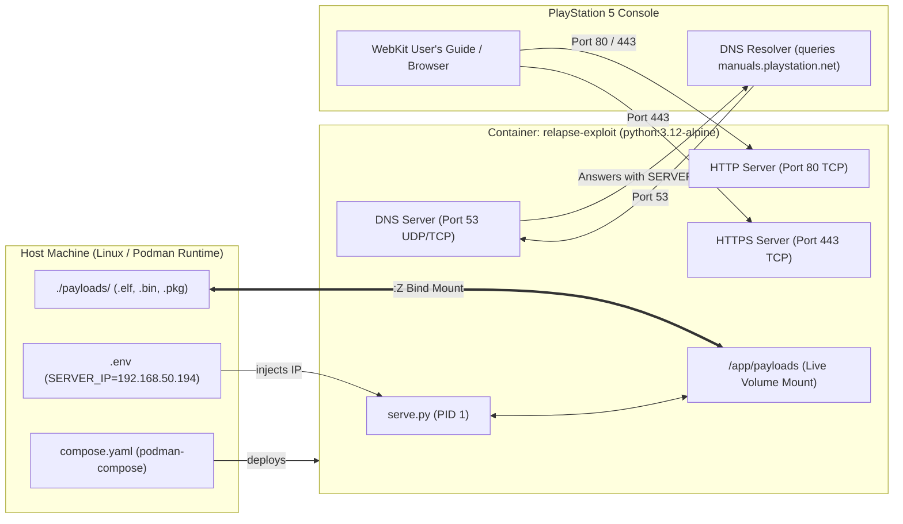

# PS5 Relapse Exploit

> **Supported Firmware Scope:** PlayStation 5 System Software `7.00` through `13.60` (33 supported firmware profiles)  
> **Target Output:** Arbitrary Kernel R/W, Root Privileges (`uid = 0`), Full Sandbox Escape, and ELF Loader Daemon listening on port `9021`.


## Stability Notes
- **WebKit Stage:** May require several attempts depending on memory layout; reload the browser if the page stalls or freezes.
- **Kernel Stage:** The asynchronous I/O race condition may occasionally hang or trigger a kernel panic. If this occurs, restart the console and retry.

---

## 1. Executive Architecture Overview

The **Relapse Exploit** (`Relapse-Exploit`) is a multi-stage jailbreak toolchain for the PlayStation 5. The exploit chains together:
1. **Userland WebKit Exploit:** Exploits JavaScriptCore (JSC) prototype getter reflection and structured clone deserialization to gain Userland Arbitrary Read/Write (ARW).
2. **Worker-Based ROP Engine:** Hijacks a Web Worker's execution stack via `libkernel` thread list traversal to execute arbitrary FreeBSD/Sony kernel system calls using `setjmp`/`longjmp` context switching.
3. **Kernel Use-After-Free (UAF) Exploit:** Exploits an asynchronous I/O race condition in `aio_multi_wait` combined with an `AF_ROUTE` KASLR bypass to achieve Slow Kernel R/W via sysctl OID corruption.
4. **Fast Kernel R/W Upgrade:** Crosses POSIX pipe buffers to provide high-speed arbitrary kernel memory read and write.
5. **Privilege Escalation & Jailbreak:** Overwrites process credentials (`ucred`), breaks out of chroot jail (`filedesc` / `rootvnode`), and unmasks restricted system calls (`dynlib`).
6. **Payload Stager & ELF Loader:** Allocates executable memory via `jitshm_create`, dynamically patches and maps shellcode (`kexp`), and launches the background ELF loader daemon on port `9021`.

---

## 2. End-to-End Execution Flowchart

```mermaid
flowchart TD
    subgraph S1["1. Delivery & Environment Setup"]
        A["serve.py (HTTP 80, HTTPS 443, DNS 53)"] --> B["index.html"]
        B --> C["src/firmware.js<br/>Match User-Agent"]
        C --> D["Load offsets/<fw>.js"]
    end

    subgraph S2["2. WebKit Userland Exploit"]
        D --> E["src/webkit.js<br/>prepareExploitObjects()"]
        E --> F["JSC Prototype Getter Bug<br/>leakScopeObject()"]
        F --> G["Oversized Symbol.toString()<br/>Leak fakeHost & targetHolder"]
        G --> H["MessageChannel Heap Grooming<br/>history.replaceState Deserialization"]
        H --> I["Corrupted Uint8Array Vector<br/>src/utils/mem.js (ARW Window)"]
        I --> J["Resolve libSceNKWebKit Base<br/>via __ps5NativeCtor"]
    end

    subgraph S3["3. Worker-Based ROP Engine"]
        J --> K["src/main.js & src/rop.js<br/>Resolve libkernel & libc"]
        K --> L["Spawn Web Worker<br/>src/utils/rop_slave.js"]
        L --> M["Traverse _thread_list<br/>Locate Worker Stack Return Slot"]
        M --> N["Hijack Return Slot via setjmp/longjmp<br/>Execute Syscalls via System V ABI"]
        N --> O["Verify Execution with SYS_GETPID"]
    end

    subgraph S4["4. Kernel Exploitation"]
        O --> P["src/relapse_exploit.js<br/>leakKernelBase() via AF_ROUTE"]
        P --> Q["pinToSingleCore()<br/>cpuset & rtprio_thread (PRI_REALTIME)"]
        Q --> R["parkAioWorkers()<br/>Park 24 Background Workers"]
        R --> S["Trigger aio_multi_wait UAF Race<br/>via ioctl churn & Sprayed Waiters"]
        S --> T["armKernelReadWrite()<br/>Corrupt kern.smp.cpus & kern.smp.maxcpus OIDs"]
        T --> U["Slow Kernel R/W Active"]
    end

    subgraph S5["5. Fast R/W, Cleanup & Escalation"]
        U --> V["locatePipes() & crossPipes()<br/>Master Pipe redirects Victim Buffer"]
        V --> W["Fast Kernel R/W Active"]
        W --> X["defuseAioGroups()<br/>Zero Armed Group Waiters"]
        X --> Y["escalate()<br/>ucred (root), rootvnode (chroot escape), dynlib (syscall unmask)"]
    end

    subgraph S6["6. Payload Staging & Daemon"]
        Y --> Z["src/kexp.js<br/>Patch payloads/kexp_2026_05_25.bin"]
        Z --> AA["Allocate RWX via SYS_JITSHM_CREATE"]
        AA --> AB["Map payloads/elfldr-ps5-1360.elf"]
        AB --> AC["Spawn Thread via pthread_create"]
        AC --> AD["ELF Loader Daemon Listening on Port 9021"]
    end
```



---

## 3. Step-by-Step Execution Breakdown

### Phase 1: Delivery & Environment Setup

1. **Local Multi-Protocol Server ([serve.py](file:///home/wolfgangsan/Repositories/PS5%20Hack/Relapse-Exploit/serve.py)):**
   - **HTTP (Port 80):** Serves [index.html](file:///home/wolfgangsan/Repositories/PS5%20Hack/Relapse-Exploit/index.html), JavaScript exploit payloads, and REST APIs (`/api/info`, `/api/payloads`, `/api/send-payload`).
   - **HTTPS (Port 443):** Serves the exploit over TLS using an auto-generated self-signed certificate for `manuals.playstation.net`, enabling exploitation directly via the PS5 User's Guide.
   - **DNS Responder (Port 53 UDP/TCP):** Intercepts DNS queries from the PS5 and resolves all hostnames to `SERVER_IP`, seamlessly redirecting the console to the exploit host.
   - **Cache Control:** Injects `Cache-Control: no-store, no-cache, must-revalidate` headers on all responses to prevent the PS5 WebKit browser from caching stale scripts or exploit artifacts.
   - **Host IP Resolution:** Detects the local LAN IP (configurable via `SERVER_IP` or `HOST_IP` environment variables) and prints direct connection instructions for the console.

2. **Firmware Detection & Script Loading ([index.html](file:///home/wolfgangsan/Repositories/PS5%20Hack/Relapse-Exploit/index.html), `src/firmware.js`):**
   - [index.html](file:///home/wolfgangsan/Repositories/PS5%20Hack/Relapse-Exploit/index.html) creates a console log UI (`<div id="console"></div>`) and loads the core scripts in sequence:
     ```html
     <script src="./src/firmware.js"></script>
     <script src="./src/main.js"></script>
     <script src="./src/rop.js"></script>
     <script src="./src/utils/syscalls.js"></script>
     <script type="module" src="./src/site.js"></script>
     ```
   - `src/firmware.js` inspects `navigator.userAgent` matching against `/PlayStation 5\/(\d+\.\d+)/`.
   - Validates that the detected firmware version is present in the `supportedFirmware` array (from `7.00` to `13.60`).
   - Sets `window.fw_str` and dynamically injects the matching profile script: `<script src="offsets/<firmware>.js">`.

---

### Phase 2: Userland WebKit Exploitation (`src/webkit.js`, `src/utils/mem.js`)

The WebKit exploit establishes Arbitrary Read/Write (ARW) within the WebKit process memory space through five sequential stages:

```
[Stage 1: Object Setup] ──> [Stage 2: Address Leak] ──> [Stage 3: Heap Grooming]
                                                                  │
[Stage 5: ARW Memory Window] <── [Stage 4: Clone Corruption] <────┘
```

1. **Stage 1 — Exploit Object Preparation:**
   - Creates a `0x100`-byte `ArrayBuffer` wrapped with `memoryView` (`Uint8Array`) and sets an 8-byte canary pattern (`0x5aa5c33cdeadbeef`) at offset `0x20`.
   - Constructs `fakeHost` with encoded header flags and `q2` referencing `memoryView`.
   - Constructs `targetHolder` referencing `nativeTarget` (`parseInt`) and DOM anchors.
   - Stores an outer graph populated with filler `BigInt` arrays into `history.replaceState`.

2. **Stage 2 — JavaScriptCore Address Leak:**
   - `leakScopeObject()` exploits prototype reflection (`Leaker.prototype.__proto__ = new Proxy({}, { get: (t, p, r) => r })`) to leak the internal lexical scope.
   - Attaches getter carrier properties holding `fakeHost` and `targetHolder` references to the scope.
   - Invokes `Symbol.prototype.toString` on a crafted symbol wrapper (`LEAK_STRING_LENGTH = 924176`), leaking raw 64-bit pointers of `fakeHost` and `targetHolder` into `capturedWords`.

3. **Stage 3 — Heap Grooming & Hole Punching:**
   - Allocates 512 chunks of `0x10000` buffers into `keepAlive` to stabilize the heap.
   - Punches butterfly holes and frees a `0x400000` memory slab using `MessageChannel.port1.postMessage` transfer lists.
   - Sprays the reclaimed predecessor allocation with 64-bit pointers to `fakeAddress` (`fakeHost + 0x10`).

4. **Stage 4 — Structured Clone Corruption & Offset Extraction:**
   - Deserializes `history.state`. Because of the object pool mismatch created by the transfer list, index `2` of the cloned array overlaps our sprayed memory.
   - Validates that the corrupted `Uint8Array`'s backing buffer matches the canary pattern (`0x5aa5c33cdeadbeef`).
   - Crafts an upgraded header (`makeUpgradedHeader`) and overwrites `fakeHost.q0`.
   - Reads `targetHolder` to find the address of `parseInt`, traverses its `FunctionExecutable` and `NativeExecutable` structures, and extracts:
     - `nativeFunction`
     - `nativeConstructor` (assigned to `globalThis.__ps5NativeCtor`).

5. **Stage 5 — Memory Window Primitive (`src/utils/mem.js`):**
   - `createMemoryWindow()` installs pointer redirection methods on `liveCandidate`.
   - `installWindowP()` exports a full memory interface (`read1`, `read2`, `read4`, `read8`, `write1`, `write2`, `write4`, `write8`, and `leakval`), allowing arbitrary userland memory access.

---

### Phase 3: Worker-Based Userland ROP Engine (`src/main.js`, `src/rop.js`, `src/utils/rop_slave.js`)

1. **Base Address Calculation:**
   - Takes `globalThis.__ps5NativeCtor` and scans candidate offsets in `OFFSET_wk_host_constructor_candidates` to determine `libSceNKWebKitBase`.
   - Reads WebKit's Global Offset Table / Import Table:
     - Reads `OFFSET_wk_memset_import` and subtracts `OFFSET_lc_memset` to find `libSceLibcInternalBase`.
     - Reads `OFFSET_wk___stack_chk_guard_import` and subtracts `OFFSET_lk___stack_chk_guard` to find `libKernelBase`.

2. **Web Worker Stack Discovery:**
   - Spawns a dedicated Web Worker running `src/utils/rop_slave.js`, which halts on `self.onmessage`.
   - Iterates through the linked list of active threads located at `libKernelBase + OFFSET_lk__thread_list`.
   - Inspects thread stack sizes, filtering for threads with a stack size of exactly `0x80000` (512 KB).
   - Scans the stack space between `0x7f000` and `0x80000` to find the exact return address matching `libKernelBase + OFFSET_lk_worker_wait_return`.

3. **ROP Execution via `setjmp` / `longjmp` Context Switching:**
   - Allocates an execution context buffer (`malloc(0x40)`).
   - Prepends the chain with a call to `setjmp` (`OFFSET_lc_setjmp`) to save CPU registers.
   - Appends the chain with a restore call to `longjmp` (`OFFSET_lc_longjmp`).
   - Overwrites the worker's stack return address with a `pop rsp` gadget pointing to `chain.stack_entry_point`.
   - Triggers execution by posting a message to the worker (`worker.postMessage(0)`).
   - Verifies ROP functionality by calling `SYS_GETPID` (0x014); compares the result against a poison value (`0x00c0ffeedeadbeef`).

---

### Phase 4: Kernel Exploitation (`src/relapse_exploit.js`)

The kernel exploit establishes arbitrary kernel read/write through the following sub-stages:

#### 4.1 Defeating Kernel ASLR (`leakKernelBase`)
- Opens an `AF_ROUTE` raw routing socket (`SYS_SOCKET, AF_ROUTE, SOCK_RAW, 0`).
- Builds an `RTM_GET` route query message specifying `RTA_DST | RTA_AUTHOR` requesting the interface address obtained from `SYS_NETGETIFLIST`.
- Sends the request via `SYS_WRITE` and receives the reply with `SYS_RECVFROM(MSG_DONTWAIT)`.
- Traverses the reply's `sockaddr` structures to locate the `AUTHOR` record (index 6).
- An uninitialized stack slot at `author + 184` contains a kernel text return address.
- Verifies the address format (`0xffffffffXXXXXXXX`) and subtracts the firmware-specific static offset (`kaslr.retStatic`) to compute `kbase`.

#### 4.2 CPU Pinning & Real-Time Priority (`pinToSingleCore`)
- Calls `SYS_CPUSET_GETAFFINITY` and `SYS_CPUSET_SETAFFINITY` (`CPU_LEVEL_WHICH`, `CPU_WHICH_TID`) to bind execution to a single CPU core.
- Calls `SYS_RTPRIO_THREAD` with `RTP_SET` and `PRI_REALTIME` to set the thread priority to real-time.
- **Purpose:** Eliminates multi-core race scheduling noise and OS thread migration during race condition timing windows.

#### 4.3 AIO Preparation & Worker Parking (`raiseFdLimit`, `parkAioWorkers`)
- Raises the process file descriptor limit via `SYS_SETRLIMIT` (`RLIMIT_NOFILE`).
- Opens a dedicated UNIX domain `socketpair`.
- Submits 24 blocking asynchronous read requests (`SYS_AIO_SUBMIT_CMD`, `AIO_CMD_READ`) against the empty socket.
- Polls via `SYS_AIO_MULTI_POLL` until all 24 worker threads transition into the in-flight state (`state == 2`).
- **Purpose:** Parks kernel AIO background worker threads so they do not interfere with the upcoming race condition.

#### 4.4 The Vulnerability: `aio_multi_wait` Use-After-Free Race Condition
- **Root Cause:** A Use-After-Free (UAF) flaw exists in the PS5 kernel's asynchronous I/O subsystem during multi-request waiting and cancellation handling (`aio_multi_wait`).
- Allocates groups of candidate AIO requests on socketpairs (`claimPendingRequests`).
- Builds forged waiter nodes (`buildWaiterNodes`) containing targeted kernel addresses:
  - `firstTarget`
  - `secondTarget`
  - `kbase + nodeMutex`
- Launches an atomic ROP batch (`runReclaimBatch`):
  1. Executes 32 `SYS_IOCTL` churn requests with slab-targeted sizes.
  2. Executes `SYS_AIO_MULTI_WAIT` with a microsecond timeout (`10,000 µs`).
  3. Executes 256 trailing `SYS_IOCTL` churn requests.
  4. Sprays 64 `SYS_AIO_SUBMIT_CMD` requests using the forged waiter nodes.
- Polls requests and cancels waiter nodes to reclaim and corrupt target kernel structures.

#### 4.5 Bootstrapping Slow Kernel Read/Write (`armKernelReadWrite`)
- Targets two kernel sysctl OID structures:
  - `kern.smp.cpus` (Steering OID `A`)
  - `kern.smp.maxcpus` (Target/Data OID `B`)
- Uses the AIO UAF to modify the OID flags (`oid.kind`), flipping them from read-only to writable (`CTLFLAG_WR`).
- **Window Steering:**
  - Modifies `kern.smp.cpus` (`setWindowLow`) to overwrite the data pointer (`oid_arg1`) of `kern.smp.maxcpus`.
  - Reading or writing `kern.smp.maxcpus` via `__sysctl` now directly reads or writes the memory pointed to by `oid_arg1`.
- Prepares a third OID (`mibC`) via `prepareHighWriter` to handle full 64-bit kernel address space redirection (`windowHigh`).
- Tests kernel read and write with self-check assertions against `walkCounter`.

#### 4.6 Upgrading to Fast Kernel Read/Write (`locatePipes`, `crossPipes`)
- Traverses the kernel `allproc` list to find the current process (`curproc`) matching `getpid()`.
- Locates the process file descriptor table (`procFdAddr`) and extracts `ucred` and `aioInfo`.
- Creates two POSIX pipes via `SYS_PIPE2`: **`master`** and **`victim`**.
- Finds the corresponding `struct pipe` kernel pointers in `fd_ofiles`.
- Verifies pipe connectivity by writing test byte `0x5a` and checking `pipe.count`.
- Using the slow sysctl write, updates `master`'s internal pipe structure:
  - `master.count = 0`
  - `master.in = 0`
  - `master.out = 0`
  - `master.size = 0x4000`
  - `master.buffer = &victim` (points `master`'s buffer directly to `victim`'s pipe struct).
- **Fast Arbitrary R/W Primitives:**
  - **Redirect:** Writing 24 bytes (`count`, `size`, `buffer`) into `master.writeFd` dynamically redirects `victim.buffer` to any arbitrary kernel memory address (`aimVictim`).
  - **Read:** Calling `SYS_READ` on `victim.readFd` performs fast arbitrary kernel reads (`kreadFast`, `readKernel32`, `readKernel64`).
  - **Write:** Calling `SYS_WRITE` on `victim.writeFd` performs fast arbitrary kernel writes (`kwriteFast`, `writeKernel32`, `writeKernel64`).
- Verifies fast R/W by reading and matching the kernel `.rodata` string probe (`rodataProbe`).

#### 4.7 Defusing AIO Groups (`defuseAioGroups`)
- Traverses the multi-level AIO group hash table located at `curproc->p_aioinfo`.
- Resolves each armed AIO group ID by index and generation.
- Safely writes `0` to the `waiters` pointer head of every armed group.
- **Purpose:** Neutralizes dangling pointers and corrupted waiter nodes, ensuring the console will not panic when the process terminates or cleans up.

---

### Phase 5: Kernel Privilege Escalation & Sandbox Escape (`escalate`)

Once Fast Kernel R/W is established, `escalate()` performs the following modifications:

| Target Structure | Field / Offset | New Value | Effect |
| :--- | :--- | :--- | :--- |
| **`ucred`** | `cr_uid`, `cr_ruid`, `cr_svuid` | `0` | Elevates Real, Effective, and Saved User ID to `root`. |
| **`ucred`** | `cr_rgid`, `cr_svgid` | `0` | Elevates Real and Saved Group ID to `wheel`/`root`. |
| **`ucred`** | `cr_ngroups` | `1` | Sets group count to 1. |
| **`ucred`** | `cr_sceAuthId` | `sysCoreAuthId` | Grants System Core Sony authentication ID (`0x4800000000000007`). |
| **`ucred`** | `cr_sceCaps`, `cr_sceCaps1` | `0xffffffffffffffff` | Grants maximum Sony kernel capabilities. |
| **`ucred`** | `cr_sceAttrs` | `(attrs \| 0x80000000)` | Enables root/system attribute flags. |
| **`filedesc`** | `fd_cdir` | `rootvnode` | Escapes chroot: sets current working directory to true filesystem root (`/`). |
| **`filedesc`** | `fd_rdir` | `rootvnode` | Escapes chroot: sets process root directory to true filesystem root (`/`). |
| **`filedesc`** | `fd_jdir` | `0` | Clears jail directory pointer (escapes FreeBSD jail). |
| **`dynlib`** | `syscallStart` | `0` | Unmasks allowed syscall range start. |
| **`dynlib`** | `syscallEnd` | `0xffffffff` | Unmasks allowed syscall range end. |
| **`dynlib`** | `restrictFlags` | `0` | Disables syscall access restrictions. |
| **`dynlib`** | `libkernelRef` | `1` | Bypasses library origin restrictions. |

**Verification:**
Calls `SYS_GETUID` (verifies `uid == 0`) and `SYS_IS_IN_SANDBOX` (verifies `sandbox == 0`).

---

### Phase 6: Payload Staging & ELF Loader Daemon (`src/kexp.js`)

1. **Symbol Resolution (`resolveSymbols`):**
   - Resolves native functions from `libkernel` (`pthread_create`, `pthread_join`, `getpid`, `sysctlbyname`, `sceKernelSendNotificationRequest`) and `libc` (`malloc`, `free`, `memcpy`, `memset`, `strcmp`, `memcmp`, `vsnprintf`).

2. **Shellcode Binary Patching (`patchShellcode`):**
   - Fetches `payloads/kexp_2026_05_25.bin` (18,912 bytes).
   - NOPs out resolver call stubs (offsets `0x1c`, `0x23`) and log call instructions.
   - Injects the resolved function addresses into the shellcode import table (`0x48b0` – `0x4900`).
   - Injects an inline `getpid` resolver at offset `0x10f1`.

3. **Executable Memory Allocation (`mapExecutable`):**
   - Allocates executable memory via `SYS_JITSHM_CREATE` with `PROT_RWX`.
   - Maps shared memory via `SYS_MMAP` (`MAP_SHARED`).
   - If direct memory copy is blocked, creates a writable alias via `SYS_JITSHM_ALIAS` (`PROT_RW`), copies the patched shellcode, and unmaps the alias.

4. **ELF Loader Mapping (`mapElf`):**
   - Fetches `payloads/elfldr-ps5-1360.elf`.
   - Allocates memory via `SYS_MMAP` (`PROT_RW`, `MAP_PRIVATE_ANON`).
   - Copies the ELF binary into the mapped region.

5. **Shellcode Kernel Communication Pipes (`prepareShellcodePipes`):**
   - Creates a dedicated pair of pipes (`master` and `victim`).
   - Directs the master pipe's buffer to the victim pipe, giving the shellcode direct access to arbitrary kernel R/W via the crossed pipe primitive.

6. **Thread Execution (`spawnAndJoin`):**
   - Prepares an argument struct with:
     - Pipe descriptors (`master.readFd`, `master.writeFd`, `victim.readFd`, `victim.writeFd`)
     - Kernel address of `allproc`
     - ELF loader base address and size
   - Spawns the payload execution thread via `pthread_create` / `pthread_create_name_np`.
   - The shellcode initializes and runs `elfldr`, which binds to TCP port `9021` and listens for incoming payload binaries.

---

### Phase 7: Cleanup, Safety & Error Recovery (`rescue`)

The `finally` block in `run()` invokes `rescue()` to ensure system stability even if any intermediate step fails:
- **`restoreThreadAttributes()`**: Restores original thread affinity mask and resets thread priority back to `PRI_NORMAL`.
- **`defuseAioGroups()`**: Clears remaining armed AIO group waiter lists to prevent kernel panics on exit.
- **`restoreOids()`**: Restores sysctl OID structures (`a`, `b`, `c`) back to their original read-only kinds and initial values.
- **`restorePipes()`**: Clears crossed pipe buffer pointers before file descriptors are closed.
- **`releaseAioWorkers()`**: Closes parked worker socket descriptors with sleep intervals to allow kernel threads to cleanly terminate.
- **`closeScratchDescriptors()`**: Closes all temporary routing and IPC file descriptors.

---

## 4. Key Data Structures & System Calls

### Essential FreeBSD / Sony System Calls

| Syscall Name | Number | Usage in Exploit Chain |
| :--- | :--- | :--- |
| `SYS_GETPID` | `0x014` | Sanity check for ROP chain execution & process identification. |
| `SYS_GETUID` | `0x018` | Privilege check verifying successful escalation to root (`0`). |
| `SYS_SOCKET` | `0x061` | Opens `AF_ROUTE` raw routing socket for KASLR address leak. |
| `SYS_SOCKETPAIR` | `0x087` | Allocates UNIX socketpairs used to block AIO worker threads. |
| `SYS_PIPE2` | `0x08D` / `0x19B` | Creates POSIX pipes for crossed-pipe fast kernel read/write. |
| `SYS___SYSCTL` | `0x0CA` | Reads and writes corrupted sysctl OIDs for slow kernel R/W. |
| `SYS_CPUSET_SETAFFINITY` | `0x1E8` | Pins current thread to a single CPU core. |
| `SYS_RTPRIO_THREAD` | `0x1D2` | Sets realtime thread scheduling priority (`PRI_REALTIME`). |
| `SYS_AIO_SUBMIT_CMD` | `0x256` | Submits asynchronous I/O read commands. |
| `SYS_AIO_MULTI_POLL` | `0x257` | Polls status of in-flight and pending AIO requests. |
| `SYS_AIO_MULTI_WAIT` | `0x258` | Waits on multiple AIO requests; triggers the UAF race condition. |
| `SYS_AIO_MULTI_CANCEL` | `0x259` | Cancels pending AIO requests during waiter array reclamation. |
| `SYS_JITSHM_CREATE` | `0x215` | Creates executable shared memory file descriptor. |
| `SYS_JITSHM_ALIAS` | `0x216` | Creates writable memory alias for JIT shared memory. |
| `SYS_IS_IN_SANDBOX` | `0x249` | Verifies that sandbox restrictions have been removed (`0`). |

---

## 5. Containerization & Deployment (Podman & Podman-Compose)

The containerization setup for **Relapse-Exploit** using **Podman** and **podman-compose** has been created and verified.

### 5.1 Container Architecture & What Was Configured



- **[Containerfile](file:///home/wolfgangsan/Repositories/PS5%20Hack/Relapse-Exploit/Containerfile)**:
  - **Base image:** `python:3.12-alpine` with `openssl` and `ca-certificates` for SSL certificate generation.
  - **Copies static assets:** [index.html](file:///home/wolfgangsan/Repositories/PS5%20Hack/Relapse-Exploit/index.html), [serve.py](file:///home/wolfgangsan/Repositories/PS5%20Hack/Relapse-Exploit/serve.py), `src/`, and `offsets/`.
  - **Exposes ports:** `80/tcp`, `443/tcp`, `53/tcp`, and `53/udp`.
  - **Sets `PYTHONUNBUFFERED=1`:** logs and payloads appear in real-time without output buffering.

- **[compose.yaml](file:///home/wolfgangsan/Repositories/PS5%20Hack/Relapse-Exploit/compose.yaml)**:
  - **Configures the `relapse-exploit` service with port bindings:**
    - `80:80/tcp` (HTTP)
    - `443:443/tcp` (HTTPS)
    - `${SERVER_IP:-0.0.0.0}:53:53/udp` (DNS responder for PS5 redirection)
  - **Coexistence with Host Resolvers:** Binds UDP port 53 specifically to `${SERVER_IP}` (your host LAN IP). This avoids conflicts with local stub resolvers like `systemd-resolved` (which listen on `127.0.0.53:53` across Fedora, Debian, Ubuntu, and Arch), allowing the container to serve the console without disrupting host DNS.
  - **Mounts the host directory `./payloads:/app/payloads:Z` as a live volume:** (with `:Z` for SELinux / Podman permission handling), allowing you to add or delete `.elf`, `.bin`, and `.pkg` payloads on the host without rebuilding the container.
  - **Passes `SERVER_IP`:** the built-in DNS server correctly advertises your host's LAN IP to the PS5.
  - **Single Compose Source:** Uses `compose.yaml` exclusively (redundant `docker-compose.yml` duplicates have been removed to eliminate compose CLI specification warnings).

- **[.containerignore](file:///home/wolfgangsan/Repositories/PS5%20Hack/Relapse-Exploit/.containerignore)**:
  - Excludes `.git`, `__pycache__`, certificates, and the payload binaries from the image build context so builds are instant and payloads stay purely in the live volume.

- **[serve.py](file:///home/wolfgangsan/Repositories/PS5%20Hack/Relapse-Exploit/serve.py)** enhancements:
  - Added `SERVER_IP` / `HOST_IP` environment variable support so the DNS responder and UI correctly route PS5 traffic to your host LAN IP.
  - Added clean `SIGTERM` / `SIGINT` handling for instantaneous graceful container shutdowns (`podman-compose down` / `podman stop`).

---

### 5.2 How to Run

#### Option 1: Automated One-Click Setup Script (`setup.sh` - Recommended)
The included script [setup.sh](file:///home/wolfgangsan/Repositories/PS5%20Hack/Relapse-Exploit/setup.sh) provides a universal, zero-friction installer across all major Linux distributions:
- **Fedora / RHEL / CentOS / AlmaLinux / Rocky**
- **Debian / Ubuntu / Linux Mint / Pop!_OS**
- **Arch Linux / Manjaro / EndeavourOS**
- **openSUSE / SLES**

It handles package dependencies, firewall configuration, DNS conflict mitigation, Docker API socket compatibility, LAN IP detection, and launches the container with automatic health verification:

```bash
cd "/home/wolfgangsan/Repositories/PS5 Hack/Relapse-Exploit"
chmod +x setup.sh
sudo ./setup.sh
```

---

#### Option 2: Rootless Podman Deployment (Unprivileged User)
If you prefer running containers without `sudo` as a standard non-root user:

1. **Allow Unprivileged Port Binding (< 1024):**
   Linux restricts ports below 1024 to root by default. Allow non-root users to bind port 53 upwards:
   ```bash
   sudo sysctl -w net.ipv4.ip_unprivileged_port_start=53
   echo "net.ipv4.ip_unprivileged_port_start = 53" | sudo tee /etc/sysctl.d/99-podman-ports.conf
   ```

2. **Launch with Podman Compose:**
   ```bash
   podman rm -f relapse-exploit 2>/dev/null || true
   podman-compose -f compose.yaml up -d
   ```

3. **Monitor Live Server Logs:**
   ```bash
   podman-compose -f compose.yaml logs -f
   ```

---

#### Option 3: Rootful Podman / Compose Deployment (with Docker Socket Compatibility)
If your system's `podman-compose` CLI provider is linked to Docker Compose v2 (such as on Fedora or Debian systems where `podman-compose` points to Docker Compose), it expects a Docker-compatible API socket:

1. **Enable the Podman Socket:**
   ```bash
   sudo systemctl enable --now podman.socket
   sudo ln -sf /run/podman/podman.sock /var/run/docker.sock
   export DOCKER_HOST="unix:///run/podman/podman.sock"
   ```

2. **Launch Container:**
   ```bash
   sudo podman-compose -f compose.yaml up -d --build
   ```

3. **Direct Podman Fallback (Native Build & Run):**
   If any compose wrapper encounters socket issues on your distro, run natively via standard Podman:
   ```bash
   podman build -t relapse-exploit:latest -f Containerfile .
   podman run -d --name relapse-exploit \
       --restart unless-stopped \
       -p 80:80/tcp \
       -p 443:443/tcp \
       -p "192.168.50.194:53:53/udp" \
       -v "$(pwd)/payloads:/app/payloads:Z" \
       -e SERVER_IP="192.168.50.194" \
       -e PYTHONUNBUFFERED=1 \
       relapse-exploit:latest
   ```

---

### 5.3 Configuring the Host IP

Your host machine's current LAN IP (`192.168.50.194`) is configured in **[.env](file:///home/wolfgangsan/Repositories/PS5%20Hack/Relapse-Exploit/.env)** (and **[.env.example](file:///home/wolfgangsan/Repositories/PS5%20Hack/Relapse-Exploit/.env.example)**). If your network IP changes:

```ini
# In .env
SERVER_IP=192.168.50.194
```

Or pass it dynamically at runtime:

```bash
SERVER_IP=192.168.50.194 podman-compose -f compose.yaml up -d
```

---

### 5.4 Managing Payloads Dynamically

Any files added, updated, or removed in `/home/wolfgangsan/Repositories/PS5 Hack/Relapse-Exploit/payloads` are synced immediately to `/app/payloads` inside the running container and appear instantly on the web interface without restarting the container:

- **Volume Mount:** `./payloads:/app/payloads:Z`
- **Supported Formats:** `.elf`, `.bin`, `.pkg`, `.exfat`
- **Git LFS Enabled:** Large assets (`*.pkg`, `*.exfat`) are tracked via Git Large File Storage (LFS).

Supported payload categories recognized by the web UI:
- **Homebrew Enablers (`etaHEN`)**: Activates kstuff, FTP server, cheats, and debug settings.
- **Kernel Patchers (`kstuff`)**: Enables execution of decrypted fself binaries and fake packages (`fpkg`).
- **Linux Bootloaders (`kexec`)**: Boots Linux (SteamOS / Ubuntu / Fedora) from USB.
- **Filesystem Mounters (`shadowmount`)**: Mounts system and game partitions for modding and dumping.
- **Payload Managers & Loaders (`elfldr`, `pldmgr`, `legacyjb`, `PS5SX`)**: Stages and executes payloads over port 9021.

---

### 5.5 Host Network & Service Configuration FAQ

#### 1. Do you need `firewall-cmd` or `ufw` on the host?

**YES, you definitely need host firewall rules.**
* **Why:** Containers sit behind the Linux host network stack. Even though Podman forwards container ports, if the host firewall blocks incoming LAN packets from the PlayStation 5, the console cannot connect.
* **Firewalld (Fedora / RHEL / openSUSE):**
  ```bash
  sudo firewall-cmd --add-service=dns --add-service=http --add-service=https --permanent
  sudo firewall-cmd --add-port=80/tcp --add-port=443/tcp --add-port=53/udp --permanent
  sudo firewall-cmd --reload
  ```
* **UFW (Ubuntu / Debian):**
  ```bash
  sudo ufw allow 80/tcp
  sudo ufw allow 443/tcp
  sudo ufw allow 53/udp
  sudo ufw reload
  ```

---

#### 2. Do you need `dnsmasq` or `bind9` on the host?

**NO, you do NOT need `dnsmasq` or `bind9`!**
* **Why:** [serve.py](file:///home/wolfgangsan/Repositories/PS5%20Hack/Relapse-Exploit/serve.py#L224-L280) inside the container includes its own **built-in DNS server**. It listens on port 53 and responds to the PS5's queries for `manuals.playstation.net` by returning your `SERVER_IP`.
* **Important:** If `dnsmasq` or `bind9` is active on the host, it will monopolize port 53 and cause an `Address already in use` conflict. Keep them disabled:
  ```bash
  sudo systemctl stop dnsmasq bind9 named 2>/dev/null || true
  sudo systemctl disable dnsmasq bind9 named 2>/dev/null || true
  ```
* **What about `systemd-resolved`?**  
  `systemd-resolved` binds to loopback addresses `127.0.0.53:53` and `127.0.0.54:53`. Because our container binds port 53 to your LAN IP (`192.168.50.194:53:53/udp`), **there is NO conflict with `systemd-resolved`**, and your host machine's internet resolution remains undisturbed!

---

#### 3. Are the required ports (80, 443, 53 UDP/TCP) enabled in the container?

**YES, all required ports are mapped and verified:**

1. **In [Containerfile](file:///home/wolfgangsan/Repositories/PS5%20Hack/Relapse-Exploit/Containerfile#L20-L24):**
   ```dockerfile
   EXPOSE 80/tcp
   EXPOSE 443/tcp
   EXPOSE 53/tcp
   EXPOSE 53/udp
   ```

2. **In [compose.yaml](file:///home/wolfgangsan/Repositories/PS5%20Hack/Relapse-Exploit/compose.yaml#L9-L14):**
   ```yaml
   ports:
     - "80:80/tcp"                    # HTTP (Exploit web page & REST APIs)
     - "443:443/tcp"                  # HTTPS (PS5 User's Guide SSL delivery)
     - "${SERVER_IP:-0.0.0.0}:53:53/udp" # DNS queries from PS5
   ```

3. **In the application ([serve.py](file:///home/wolfgangsan/Repositories/PS5%20Hack/Relapse-Exploit/serve.py)):**
   - **Port 80 (TCP):** Serves `index.html`, JavaScript exploit files, and `/api/payloads`.
   - **Port 443 (TCP):** Serves over HTTPS with self-signed SSL for `manuals.playstation.net`.
   - **Port 53 (UDP):** Built-in DNS responder directing PS5 traffic to `SERVER_IP`.

#### Summary Comparison

| Component | Handled by Host | Handled by Container | Notes |
| :--- | :---: | :---: | :--- |
| **Firewall rules (80, 443, 53)** | **Yes** (`firewall-cmd` / `ufw`) | — | Necessary so the host OS permits incoming LAN traffic from the PS5. |
| **HTTP Web Server (80)** | — | **Yes** (`serve.py`) | Mapped via `80:80/tcp`. |
| **HTTPS Web Server (443)** | — | **Yes** (`serve.py`) | Mapped via `443:443/tcp`. |
| **DNS Server (53)** | **No** (Do not run `dnsmasq`) | **Yes** (`serve.py`) | Built into `serve.py`; mapped via `${SERVER_IP}:53:53/udp`. |

---

### 5.6 Multi-Distro Automated Script: `setup.sh`

The automated setup and launch script [setup.sh](file:///home/wolfgangsan/Repositories/PS5%20Hack/Relapse-Exploit/setup.sh) has been created and marked executable (`chmod +x setup.sh`).

#### Features of [setup.sh](file:///home/wolfgangsan/Repositories/PS5%20Hack/Relapse-Exploit/setup.sh):
- **Multi-Distro OS Identification (`/etc/os-release`):**
  - **Fedora / RHEL / CentOS / AlmaLinux / Rocky:** Uses `dnf` to install `podman`, `podman-compose`, `firewalld`, and `curl`.
  - **Debian / Ubuntu / Linux Mint / Pop!_OS:** Uses `apt-get` to install `podman`, `podman-compose` (with automatic pip fallback), `ufw`, and `curl`.
  - **Arch Linux / Manjaro / EndeavourOS:** Uses `pacman -Sy --needed` to install `podman`, `podman-compose`, and `curl`.
  - **openSUSE / SLES:** Uses `zypper` to install `podman`, `podman-compose`, and `curl`.
- **Port 53 Conflict Resolution & Sysctl Optimization:**
  - Automatically identifies and stops active `dnsmasq`, `bind9`, or `named` daemons to free port 53.
  - Sets `net.ipv4.ip_unprivileged_port_start = 53` in memory and persists to `/etc/sysctl.d/99-podman-ports.conf`.
- **Automated Host Firewall Setup:**
  - For `firewalld`: Permanently opens `dns`, `http`, `https` services and `80/tcp`, `443/tcp`, `53/udp` ports, then reloads.
  - For `ufw`: Allows `80/tcp`, `443/tcp`, and `53/udp`, then reloads.
- **Docker Socket & Compose API Compatibility:**
  - Automatically enables and starts `podman.socket` via systemd.
  - Ensures `/var/run/docker.sock` points to `/run/podman/podman.sock` for Docker Compose v2 CLI plugins.
  - Sets `DOCKER_HOST="unix:///run/podman/podman.sock"`.
  - Includes a direct native `podman build` and `podman run` fallback if compose providers report unexpected socket errors.
- **LAN IP Auto-Detection & `.env` Configuration:**
  - Discovers the host's actual default route LAN IP (avoiding local loopbacks and container bridges).
  - Updates [.env](file:///home/wolfgangsan/Repositories/PS5%20Hack/Relapse-Exploit/.env) with `SERVER_IP=<detected_lan_ip>`.
- **Container Health Check & Verification:**
  - Launches container with live payload volume mounting (`./payloads:/app/payloads:Z`).
  - Polls `http://127.0.0.1:80/api/info` to verify the container has started and responds with `HTTP 200 OK`.
  - Displays a formatted operational banner with connection instructions for the PlayStation 5.

#### How to Run the Setup Script

```bash
cd "/home/wolfgangsan/Repositories/PS5 Hack/Relapse-Exploit"
sudo ./setup.sh
```

---

## 6. Repository Structure & File Mapping

```
Relapse-Exploit/
├── index.html                   # Entry point webpage & script loader
├── serve.py                     # Multi-protocol server (HTTP 80, HTTPS 443, DNS 53, REST API)
├── Containerfile                # Podman container build definition (python:3.12-alpine)
├── compose.yaml                 # Podman Compose service definition
├── .containerignore             # Podman build ignore rules
├── .env.example                 # Environment variable template for host LAN IP configuration
├── .env                         # Active environment configuration
├── setup.sh                     # Multi-distro automated host setup & runner (Fedora/Debian/Arch/openSUSE)
├── Workflow.png                 # Architectural visual diagram
├── README.md                    # Unified project documentation, architecture, deployment & credits
├── LICENSE                      # Project license
├── payloads/                    # Dynamic payload volume directory (.elf, .bin, .pkg)
│   ├── elfldr-ps5-1360.elf      # ELF loader daemon listening on port 9021
│   └── kexp_2026_05_25.bin      # Kernel bootstrap shellcode (18,912 bytes)
├── offsets/
│   ├── 7.00.js ... 13.60.js     # Per-firmware gadget, syscall, and kernel RVA profiles
└── src/
    ├── firmware.js              # User-Agent parser & firmware validator
    ├── main.js                  # Userland ROP setup, worker stack scan & entry point
    ├── relapse_exploit.js       # Kernel exploit engine (KASLR, AIO UAF, pipes, root)
    ├── kexp.js                  # Shellcode patcher, JIT memory mapper & ELF loader launcher
    ├── webkit.js                # WebKit JSC exploit (ARW memory window primitive)
    ├── rop.js                   # ROP chain builder & worker-based execution runtime
    ├── site.js                  # Front-end UI logger & workflow orchestrator
    └── utils/
        ├── int64.js             # 64-bit integer arithmetic helper class
        ├── mem.js               # Userland memory read/write abstractions
        ├── rop_slave.js         # Dedicated Web Worker used for ROP stack hijacking
        └── syscalls.js          # FreeBSD/PS5 syscall number definitions
```

---

## 7. Credits & Acknowledgements

- **Sonic_Iso:** Kernel Exploit
- **Jordy:** WebKit Exploit and Kernel Bug Discovery
- **ntfargo:** Exploit Development
- **ufm42:** Exploit Development
- **Dr. Yenyen:** Testing & Validation

**Special Thanks & Community Contributions:**
TheFlow, SlidyBat, Flatz, cow, nhk, bollarz, Sleirsgoevy, EchoStretch, EarthOnion.

---

## 8. Disclaimer

This project is intended for **educational and security research purposes only**. It does not endorse piracy, unauthorized access, or misuse of commercial devices. Use it only on devices you own or are authorized to test, and comply with applicable local laws and regulations.

The software is provided as-is, without warranty of any kind. You assume all risks of using it, including system instability, data loss, and console or account restrictions. The maintainers accept no liability for any resulting damage.